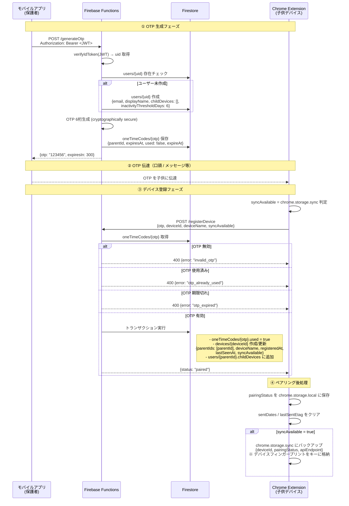
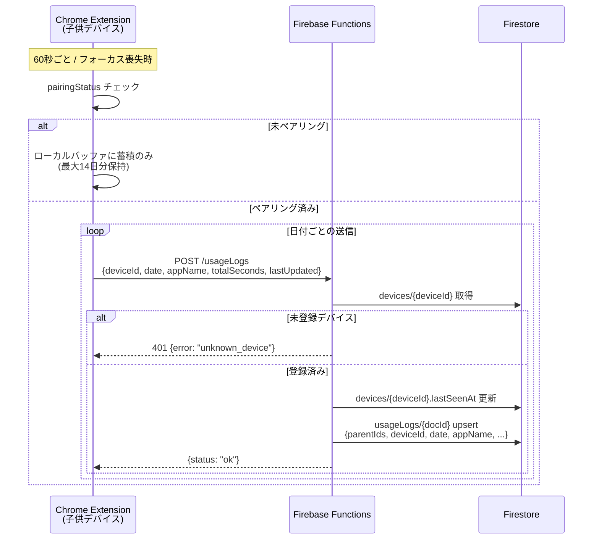
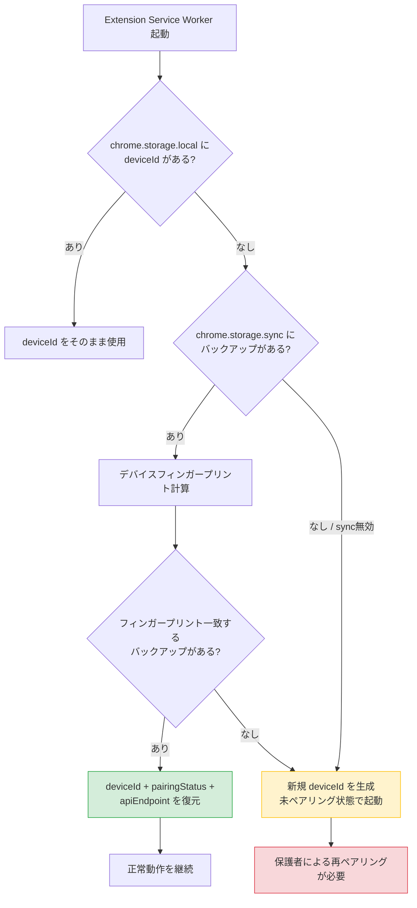
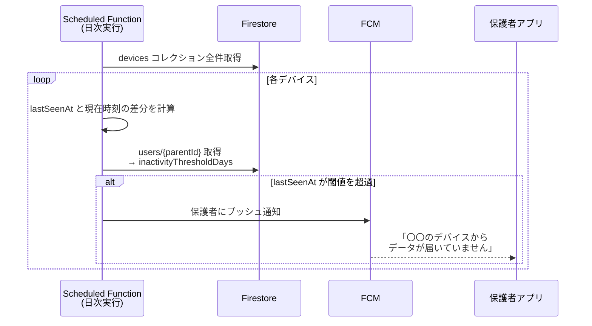

# S02: OTP ペアリング データフローダイアグラム

## 1. OTP 生成 〜 デバイス登録フロー

```mermaid
sequenceDiagram
    participant Parent as モバイルアプリ<br/>(保護者)
    participant Functions as Firebase Functions
    participant Firestore as Firestore
    participant Extension as Chrome Extension<br/>(子供デバイス)

    Note over Parent,Extension: ① OTP 生成フェーズ
    Parent->>Functions: POST /generateOtp<br/>Authorization: Bearer <JWT>
    Functions->>Functions: verifyIdToken(JWT) → uid 取得
    Functions->>Firestore: users/{uid} 存在チェック
    alt ユーザー未作成
        Functions->>Firestore: users/{uid} 作成<br/>{email, displayName, childDevices: [],<br/>inactivityThresholdDays: 6}
    end
    Functions->>Functions: OTP 6桁生成 (cryptographically secure)
    Functions->>Firestore: oneTimeCodes/{otp} 保存<br/>{parentId, expiresAt, used: false, expireAt}
    Functions-->>Parent: {otp: "123456", expiresIn: 300}

    Note over Parent,Extension: ② OTP 伝達（口頭 / メッセージ等）
    Parent-->>Extension: OTP を子供に伝達

    Note over Parent,Extension: ③ デバイス登録フェーズ
    Extension->>Extension: syncAvailable = chrome.storage.sync 判定
    Extension->>Functions: POST /registerDevice<br/>{otp, deviceId, deviceName, syncAvailable}
    Functions->>Firestore: oneTimeCodes/{otp} 取得
    alt OTP 無効
        Functions-->>Extension: 400 {error: "invalid_otp"}
    else OTP 使用済み
        Functions-->>Extension: 400 {error: "otp_already_used"}
    else OTP 期限切れ
        Functions-->>Extension: 400 {error: "otp_expired"}
    else OTP 有効
        Functions->>Firestore: トランザクション実行
        Note right of Firestore: - oneTimeCodes/{otp}.used = true<br/>- devices/{deviceId} 作成/更新<br/>  {parentIds: [parentId], deviceName, registeredAt,<br/>   lastSeenAt, syncAvailable}<br/>- users/{parentId}.childDevices に追加
        Functions-->>Extension: {status: "paired"}
    end

    Note over Extension: ④ ペアリング後処理
    Extension->>Extension: pairingStatus を chrome.storage.local に保存
    Extension->>Extension: sentDates / lastSentEtag をクリア
    alt syncAvailable = true
        Extension->>Extension: chrome.storage.sync にバックアップ<br/>{deviceId, pairingStatus, apiEndpoint}<br/>※ デバイスフィンガープリントをキーに格納
    end
```

## 2. 利用ログ送信フロー（ペアリング後）

```mermaid
sequenceDiagram
    participant Extension as Chrome Extension<br/>(子供デバイス)
    participant Functions as Firebase Functions
    participant Firestore as Firestore

    Note over Extension: 60秒ごと / フォーカス喪失時
    Extension->>Extension: pairingStatus チェック
    alt 未ペアリング
        Extension->>Extension: ローカルバッファに蓄積のみ<br/>(最大14日分保持)
    else ペアリング済み
        loop 日付ごとの送信
            Extension->>Functions: POST /usageLogs<br/>{deviceId, date, appName, totalSeconds, lastUpdated}
            Functions->>Firestore: devices/{deviceId} 取得
            alt 未登録デバイス
                Functions-->>Extension: 401 {error: "unknown_device"}
            else 登録済み
                Functions->>Firestore: devices/{deviceId}.lastSeenAt 更新
                Functions->>Firestore: usageLogs/{docId} upsert<br/>{parentIds, deviceId, date, appName, ...}
                Functions-->>Extension: {status: "ok"}
            end
        end
    end
```

## 3. deviceId 復旧フロー（chrome.storage.local クリア後）

```mermaid
flowchart TD
    A[Extension Service Worker 起動] --> B{chrome.storage.local に<br/>deviceId がある?}
    B -->|あり| C[deviceId をそのまま使用]
    B -->|なし| D{chrome.storage.sync に<br/>バックアップがある?}
    D -->|あり| E[デバイスフィンガープリント計算]
    E --> F{フィンガープリント一致する<br/>バックアップがある?}
    F -->|あり| G[deviceId + pairingStatus +<br/>apiEndpoint を復元]
    G --> H[正常動作を継続]
    F -->|なし| I[新規 deviceId を生成<br/>未ペアリング状態で起動]
    D -->|なし / sync無効| I
    I --> J[保護者による再ペアリングが必要]

    style G fill:#d4edda,stroke:#28a745
    style I fill:#fff3cd,stroke:#ffc107
    style J fill:#f8d7da,stroke:#dc3545
```

## 4. 無操作検知フロー（後続スプリントで実装）

```mermaid
sequenceDiagram
    participant Scheduler as Scheduled Function<br/>(日次実行)
    participant Firestore as Firestore
    participant FCM as FCM
    participant Parent as 保護者アプリ

    Scheduler->>Firestore: devices コレクション全件取得
    loop 各デバイス
        Scheduler->>Scheduler: lastSeenAt と現在時刻の差分を計算
        Scheduler->>Firestore: users/{parentId} 取得<br/>→ inactivityThresholdDays
        alt lastSeenAt が閾値を超過
            Scheduler->>FCM: 保護者にプッシュ通知
            FCM-->>Parent: 「〇〇のデバイスから<br/>データが届いていません」
        end
    end
```
