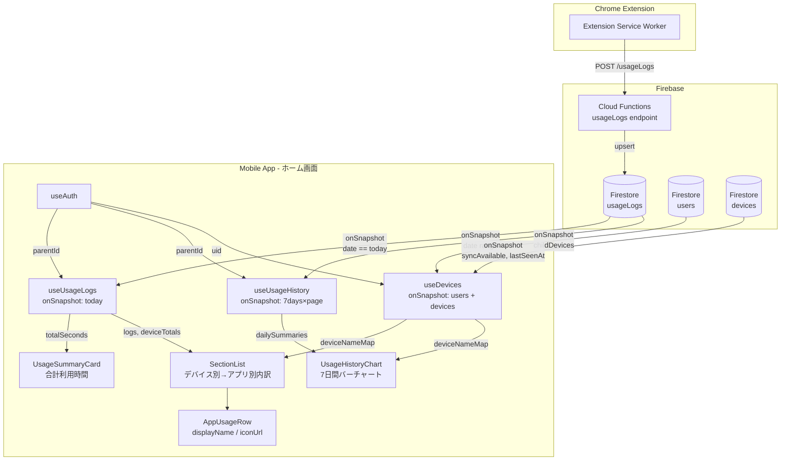
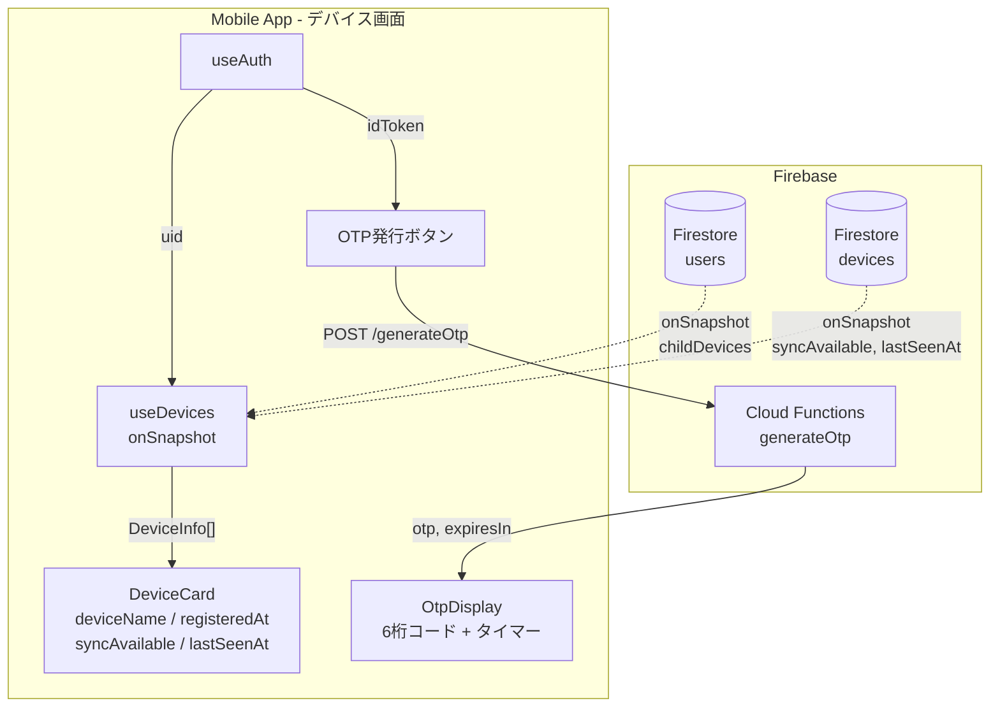

# S03 モバイルアプリ データフロー図

## ホーム画面のデータフロー



## デバイス管理画面のデータフロー



## コンポーネント階層

```mermaid
graph TD
    ROOT["_layout.tsx<br/>(Root Layout + Auth Guard)"]

    ROOT --> AUTH_LAYOUT["(auth)/_layout.tsx"]
    AUTH_LAYOUT --> LOGIN["login.tsx"]

    ROOT --> TABS_LAYOUT["(tabs)/_layout.tsx<br/>(Tab Navigator)"]
    TABS_LAYOUT --> HOME["index.tsx<br/>(ホーム)"]
    TABS_LAYOUT --> DEVICES["devices.tsx<br/>(デバイス管理)"]
    TABS_LAYOUT --> SETTINGS["settings.tsx<br/>(設定)"]

    HOME --> SUMMARY_CARD[UsageSummaryCard]
    HOME --> HISTORY_CHART[UsageHistoryChart]
    HOME --> APP_ROW_H[AppUsageRow]

    HISTORY_CHART --> APP_ROW_C[AppUsageRow<br/>(内訳表示)]

    DEVICES --> DEVICE_CARD[DeviceCard]
    DEVICES --> OTP_DISPLAY[OtpDisplay]

    HOME -.->|hooks| USE_AUTH_H[useAuth]
    HOME -.->|hooks| USE_LOGS[useUsageLogs]
    HOME -.->|hooks| USE_HISTORY[useUsageHistory]
    HOME -.->|hooks| USE_DEVICES_H[useDevices]

    DEVICES -.->|hooks| USE_AUTH_D[useAuth]
    DEVICES -.->|hooks| USE_DEVICES_D[useDevices]
```
